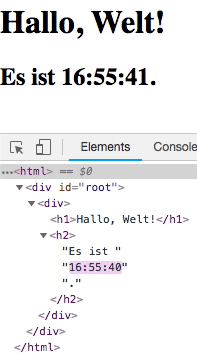

Elemente sind die kleinsten Bestandteile von React-Apps.

Ein Element beschreibt was du auf dem Bildschirm sehen möchtest:

```js
const element = <h1>Hallo Welt</h1>;
```

Anders als die DOM Elemente eines Browsers, sind React Elemente schlichte kosteneffektive Objekte.
React DOM kümmert sich um das Aktualisieren des DOMs und den dazugehörigen React Elementen.

>**Hinweis:**
>
>Man könnte Elemente mit dem allgemein bekannterem Konzept der "Komponenten" verwechseln. Komponenten werden wir
>im [nächsten Abschnitt](/docs/components-and-props.html) behandeln.
>Elemente sind das, woraus Komponenten "gemacht" werden und wir empfehlen dir erst diesen Abschnitt zu lesen, bevor du weiter machst.

## Ein Element in das DOM rendern {#rendering-an-element-into-the-dom}

Nehmen wir mal an, wir haben ein `<div>` Element irgendwo in einer HTML-Datei:

```html
<div id="root"></div>
```

Dieses Element nennen wir "root" DOM Knoten. Alles innerhalb dieses Elements wird von React DOM verwaltet.

Anwendungen, die mit React gebaut worden, haben normalerweise nur einen root DOM Knoten. Wenn du React in eine bestehende Anwendung einfügst, kannst du aber soviele DOM Knoten haben, wie du möchtest.

<<<<<<< HEAD
Um ein Element in den root DOM Knoten zu rendern, muss du nur beides an `ReactDOM.render()` übergeben:
=======
To render a React element into a root DOM node, pass both to [`ReactDOM.render()`](/docs/react-dom.html#render):
>>>>>>> fb382ccb13e30e0d186b88ec357bb51e91de6504

`embed:rendering-elements/render-an-element.js`

[Auf CodePen ausprobieren](codepen://rendering-elements/render-an-element)

Es wird "Hallo Welt" auf der Seite angezeigt.

## Aktualisieren des gerenderten Elements {#updating-the-rendered-element}

React Elemente sind [immuntable](https://en.wikipedia.org/wiki/Immutable_object) (unveränderbar). Wenn du einmal ein Element erstellt hast, kannst du dessen
Kind-Elemente oder Attribute nicht mehr verändern. Eine Element kannst du dir vorstellen, wie ein einzelnes Bild eines Filmes: Es repräsentiert die Benutzeroberfläche (UI) zu einem bestimmten Zeitpunkt.

<<<<<<< HEAD
Mit dem was wir bis jetzt erfahren haben, wissen wir nur, dass der einzige Weg um die Benutzeroberfläche zu Aktualisieren und neue Elemente zu erstellen, das Aufrufen von `ReactDOM.render()` ist.
=======
With our knowledge so far, the only way to update the UI is to create a new element, and pass it to [`ReactDOM.render()`](/docs/react-dom.html#render).
>>>>>>> fb382ccb13e30e0d186b88ec357bb51e91de6504

Wir nehmen uns einmal dieses Beispiel einer tickenden Uhr:

`embed:rendering-elements/update-rendered-element.js`

[Auf CodePen ausprobieren](codepen://rendering-elements/update-rendered-element)

<<<<<<< HEAD
Jede Sekunden wird `ReactDOM.render()` mit Hilfe einer Callback-Funktion von [`setInterval()`](https://developer.mozilla.org/en-US/docs/Web/API/WindowTimers/setInterval) aufgerufen.
=======
It calls [`ReactDOM.render()`](/docs/react-dom.html#render) every second from a [`setInterval()`](https://developer.mozilla.org/en-US/docs/Web/API/WindowTimers/setInterval) callback.
>>>>>>> fb382ccb13e30e0d186b88ec357bb51e91de6504

>**Hinweis:**
>
<<<<<<< HEAD
>In der Praxis rufen die meisten React Anwendungen `ReactDOM.render()` nur einmal auf. Im nächsten Abschnitt lernen wir, wie solch ein Code in einzelne [Zustandskomponenten](/docs/state-and-lifecycle.html) gekapselt wird.
=======
>In practice, most React apps only call [`ReactDOM.render()`](/docs/react-dom.html#render) once. In the next sections we will learn how such code gets encapsulated into [stateful components](/docs/state-and-lifecycle.html).
>>>>>>> fb382ccb13e30e0d186b88ec357bb51e91de6504
>
>Wir empfehlen dir, Abschnitte nicht zu überspringen, da sie aufeinander aufbauen.

## React aktualisiert nur das Nötigste {#react-only-updates-whats-necessary}

React DOM vergleicht das vorherige und jetztige Element und dessen Kindelemente miteinander.
Um das DOM in den gwünschten Zustand zu bringen, werden nur die Elemente im DOM aktualisiert, die wirklich eine Änderung beinhalten.

Du kannst es nachprüfen, indem du das [letzte Beispiel](codepen://rendering-elements/update-rendered-element) mit den Browser Tools aufrufst:



Obwohl wir jede Sekunde ein Element erstellen, das den kompletten UI Baum aktualisiert, wird nur der Text-Inhalt durch React DOM aktualisiert, dessen Inhalt sich wirklich geändert hat.

<<<<<<< HEAD
Nach unserer Erfahrung macht es mehr Sinn darüber nachzudenken, wie die Benutzeroberfläche zu einem bestimmten Zeitpunkt aussieht, anstatt
sich darüber Gedanken zu machen, wie sie sich im Laufe der Zeit verändert. Dieses Denken verhindert eine ganze Reihe von Fehlern.
=======
In our experience, thinking about how the UI should look at any given moment, rather than how to change it over time, eliminates a whole class of bugs.
>>>>>>> fb382ccb13e30e0d186b88ec357bb51e91de6504
